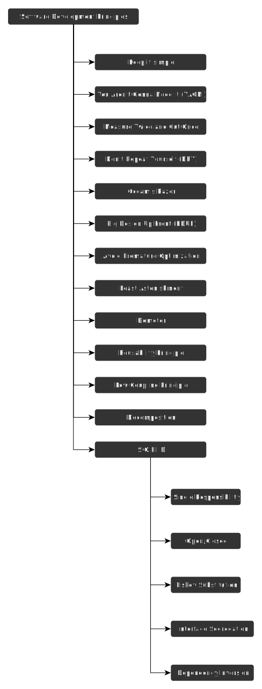

# Software Development Principles

## Single Responsibility Principle

Bir sınıfın değiştirilmesi için yalnızca tek bir sebep olmalıdır. Bu nedenle her sınıf tek bir göreve sahip olmalıdır ki değiştirilmesi için birden fazla neden olmasın. Bunu gerçekleştirmek ilk aşamalarda zor olacaktır fakat projenin büyümesi durumunda değişiklikler yapılacağı zaman işleri oldukça hızlandıracaktır. Eğer bir sınıf birden fazla görevi yerine getiriyorsa bu sınıfın ayrılması gerekmektedir. Fakat şunu da göz önünde bulundurmak gerekiyor ki bazı projelerde tek sorumluluk prensibi mantıklı olmayacaktır. Bu nedenle yazılım tasarımı yapılırken isterler göz önünde bulundurulmalıdır.

## Open/Closed Principle

Sınıflar ve metodlar genişletilmeye açık fakat düzenlemeye kapalı olmalıdır. Temel amaç yeni özelliklerin eklenmesi durumunda mevcut olan özelliklerin halen kullanılabilir olmasını sağlamaktır. Sistem kendi içerisinde düzenlemeye kapalı olmalıdır. Bazı durumlarda sınıfın genişletimesini engelemek amacıyla sabitleme yapılabilir. Bu durumda bu sınıf kapalıdır diyebiliriz. Bir sınıfın açık olması demek o sınıfın farklı sınıflarda da kullanılması veya güncelleştirmeler için eklemelerin yapılabileceği şekilde olması bu sınıfın açık olduğu anlamına geliyor.

## Liskov Subsitution Principle

## Interface Segregation Principle

Arayüz ayırma prensibi bazı durumlarda kodun kullanmadığı yöntemlere zorunlu olarak bağlı olması gerektiği durumlarda ortaya çıkmaktadır. Örneğin: araç isminde bir sınıf olsun ve bu sınıfın gitmek ve uçmak isminde iki adet metodu olsun. Şayet söz konusu olan bağımlılık bir uçak üzerinden yapılacaksa hiçbir sorun yoktur fakat arabada bir araç olmasına rağmen sadece gitmek metodunu yerine getirecek ve zorunlu olarak uçmak metoduna da bağlı kalmak zorunda kalacaktır. Bu tip durumlarda araç ile araba arasında arayüz ayırma prensibini uygulamamız gerekmektedir. Bu sayede kimse zorunlu olarak bir yönteme bağlı kalmayacaktır. Her arayüz birbiri ile izole edilmiş duruma gelecektir.

## Dependency Inversion Principle

Bağımlılığı ters çevirme prensibi yüksek seviyeleri sınıfların daha aşağı seviyeli sınıflara olan bağımlığını tersine çevirerek aşağı seviyeli sınıfları yüksek seviyeli sınıflara bağımlı yapar. Bunun oluşturulma sebebinde yatan etken yüksek seviyeli sınıf aşağı seviyeli sınıfa bağımlı olduğunda ve aşağı seviyeli sınıfta yapılan en küçük bir değişiklikte bile yüksek seviyeli sınıf üzerinde de değişikliklere gidilmesi ihtiyacını ortadan kaldırmaktır. Bağımlılığı soyutlama veya arayüz ile tersine çevirdiğimizde aşağı seviyeli sınıflarda yapılan her hangi bir değişiklik yüksek seviyeli sınıfları etkilemeyecektir.

---

## Other Software Principles

### Decomposition

### Don’t Repeat Yourself

### Keep It Simple, Stupid!

### You ain’t gonna need it

### Reusability Principle

### Low Coupling Principle